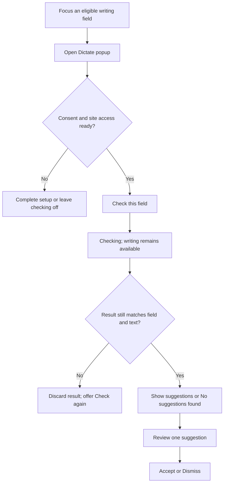

# Dictate design and interaction specification v0.3

Status: A+D hybrid brand direction and visual mockups approved as direction only. The UX flows and interaction rules below are a review draft, not user-approved behaviour or authorisation to implement. Pixel-perfect UI specifications and final design tokens remain pending. [BRAND.md](BRAND.md) is the source of truth for brand personality, palette direction and creative boundaries.

Positioning: a clean, premium, useful and credible writing assistant with a satirical fictional brand universe. Keep the core editing experience calm and legible; place character and humour in surrounding brand moments and optional microcopy. Do not imitate Grammarly's visual identity.

## UI principles
- UI should feel native to Chrome and not obstruct writing.
- Inline underlines: restrained, sufficiently contrasted, stable when the page scrolls.
- Suggestion cards: concise explanation, clearly distinguished original/replacement, Accept, Dismiss and optional Undo.
- Toolbar popup: small, high-quality status panel with quick settings and test connection.
- Writing workspace: optional separate view for longer text and rewrite actions.
- Theme: light first with thoughtful dark mode; consistent typography, spacing and motion; reduced-motion support.
- Do not use a conspicuous floating badge on every page before an explicit enable action unless user approves this behaviour.
- Screenshots and browser tests must cover light/dark, narrow layouts, keyboard navigation and zoom.

## Applying the brand to the interface
- Apply the selected warm cream, vivid orange, charcoal and sand direction, with limited sunset orange and sage accents. Shown hex values remain preliminary until verified; contrast-safe combinations and dark-mode equivalents require approval.
- Keep Accept, Dismiss, Undo, consent, permissions, privacy and error recovery direct and unambiguous. Do not use the mascot's authoritarian persona to pressure users into sharing text or accepting edits.
- Use the original Supreme Editor character primarily in marketing/onboarding and the minimalist crowned-nib emblem for the logo and extension icon. Inline cards and underlines must prioritise the user's writing and usable controls.
- Separate decorative display typography from readable interface typography. Do not put poster textures or decorative lettering behind correction text.
- Status and suggestion categories must remain understandable without colour alone. Verify contrast, focus visibility, zoom and small-size icon legibility in the proposed designs.

The earlier editorial/teal, technical/blue and creative/violet routes were unapproved explorations and are superseded by the cream/orange/black direction recorded in [DECISIONS.md](DECISIONS.md).

## Next design review
The A+D route is selected. The immediate next deliverable is UX flows and interaction specifications before Codex implementation:

- Onboarding and consent: explain checking, permissions and text sharing; define enable, decline and recovery paths.
- Standard inline editing: explicit check → loading → suggestion → accept/dismiss → undo where supported; define selection/focus, keyboard operation, stale results and scroll/resize behaviour.
- Toolbar popup and settings: status, site enable/disable, checking controls and preferences, including persistence and feedback.
- State coverage: empty, success, loading, offline, provider failure and quota exhaustion; keep correction, consent and recovery copy plain.

Review these flows in popup, inline suggestion-card and onboarding/consent mockups with light/dark, narrow, zoomed and keyboard/focus views. Evaluate proposed Bebas Neue headings/Inter body and emblem legibility at actual icon sizes. The approved visual references guide appearance but do not specify exact layouts or behaviour. The [brand brief](BRAND.md) lists unresolved decisions; the [asset handoff](../../assets/brand/README.md) defines expected deliverables. Final requirements, design and technical decisions must be agreed before the first bounded implementation brief. Google Docs remains a high-priority follow-on milestone after standard inline editing works. This review does not authorise application implementation.

## Proposed UX contract — review draft

These are recommended defaults to review together. They deliberately leave provider, framework, permission implementation and exact visual tokens unresolved. The first vertical slice supports one ordinary textarea; contenteditable follows, then the high-priority Google Docs milestone. A tone selector, rewrite workspace and automatic checking are outside this first slice.

### Flow 1 — first use and consent

1. Onboarding introduces Dictate, the crowned-nib identity and the Supreme Editor illustration. Use the Ministry of Clarity personality in a short welcome; explain the actual checking behaviour plainly.
2. Explain that checking begins only after an explicit action. Do not collect page text merely because onboarding or the popup opens.
3. Once the inference approach is selected, show the actual processing location/provider, what text is sent, purpose, retention information and relevant permissions. Unresolved facts block a production consent screen; do not insert invented privacy promises.
4. Offer equally understandable **Continue** and **Not now** paths. Declining leaves checking off and makes setup available from the popup later. Browser permission approval and text-processing consent are separate requirements.
5. Request access only as needed for the current site, subject to the technical permission review. A denial leaves the site off with a plain explanation and a user-initiated retry path.
6. Offer a synthetic sample in onboarding once setup is complete. A check of that sample still requires explicit action and applicable processing consent. No real document is checked automatically.

Closing onboarding at any point preserves only completed setup choices. Revoking processing consent stops new checks, clears visible results and invalidates pending results. Cancellation cannot promise to retract text already sent to a provider. A material change of provider or processing terms requires renewed consent before another check.

### Flow 2 — select a field and check

- The popup targets the last focused eligible field in the active tab. Opening it must not lose the identity or selection of that field. If there is no valid target, **Check this field** is disabled and the popup says “Click in a writing field first.” Never fall back to reading the whole page or a different field.
- The initial check covers the whole target field, not a hidden selection-only mode. Display “Checks this field only” beside the action. Empty fields do not create requests. Password, disabled, read-only and sensitive non-writing fields are ineligible. Unsupported editors get a clear unsupported state.
- Snapshot the text and field identity on explicit check. Do not truncate oversized text silently: explain the agreed limit and ask the user to shorten it. The exact limit and timeout are technical decisions that must be fixed in the implementation brief.
- One request per target field may be active. Disable duplicate checks while checking; offer **Cancel**. Closing the popup does not constitute cancellation. Reopening shows the same current request state without resending text.
- Typing remains available. Any text change while checking invalidates that request; stop it where possible and ignore late results. Site disable, consent revocation, navigation, field removal or target replacement also invalidate results. Never apply a response to a new field or page.
- Show anchored underlines only for validated current results. No floating page badge is required. Scroll, resize and zoom must reposition annotations without modifying the document; hide annotations whose anchor cannot be verified.

### Flow 3 — review, accept, dismiss and undo

Clicking an underline opens one suggestion card. Hover may reveal the same card, but must never be the only way to access a suggestion. **Review suggestions** in the popup returns focus to the page and opens the first current suggestion, providing a keyboard-accessible entry point without requiring focusable decorations inside the user's text.

Card reading order:

1. Category and position, such as “Grammar · 1 of 2”.
2. Original text and replacement, explicitly labelled rather than distinguished by colour alone.
3. One concise explanation.
4. **Accept**, **Dismiss**, **Previous**, **Next**, **Close** as applicable.

Example fixture: original “She go to work.” → replacement “She goes to work.” Explanation: “Use ‘goes’ with ‘she’.” This is a deterministic test example, not a guarantee of model output.

| Action | Proposed behaviour | Safeguard |
| --- | --- | --- |
| Accept | Apply only the displayed replacement and announce “Change applied.” Restore editor focus with the caret after the replacement. | Revalidate the field, original text and range immediately before applying. If they differ, apply nothing and offer Check again. |
| Dismiss | Hide that suggestion for the current check; leave text and selection unchanged. Advance to the next suggestion if one exists. | Do not silently create an ignore rule or dictionary entry. A fresh check may report it again. |
| Undo | After an accepted change, expose Undo until the next field edit or accepted change. Restore the exact replaced text and previous selection only while the post-edit snapshot still matches. | If intervening changes occurred, disable the app's Undo rather than overwrite newer writing. Native editor undo compatibility must be tested separately. |
| Close / Escape | Close the card without accepting or dismissing. Return focus to its trigger, or the editor if the trigger no longer exists. | No accidental edit from closing, clicking elsewhere or switching tabs. |
| Previous / Next | Navigate the current result set in document order. | No implicit acceptance and no keyboard trap. |

For the first slice, any accepted change or manual text edit invalidates remaining suggestions in that field. Clear their annotations and offer **Check again**; do not silently send another request or attempt speculative range remapping. After Undo, a new check is also required. This conservative rule should be reviewed for usability before expanding to richer editors.

### Flow 4 — popup and settings

Popup information order: compact emblem/Dictate wordmark → current site and on/off state → checking status → primary action → suggestion count/review action → settings. Keep the mascot illustration out of this small control surface.

| Control | Proposed default and persistence |
| --- | --- |
| Global checking switch | Off until setup is complete. Store the explicit user choice locally. Turning off stops new checks, clears annotations and invalidates in-flight results across tabs. |
| Site switch | Off until the user enables that site. Propose exact-origin scope, with no automatic inclusion of subdomains; validate the permission design before implementation. Show the affected site clearly. |
| Check this field | Explicit action only; enabled only with consent, permitted site and valid non-empty target. |
| Review suggestions | Available only for current validated results; keyboard-accessible path into the page card. |
| Appearance | Proposed System/Light/Dark preference, stored locally; visual tokens remain unapproved. |
| Processing settings | Show the selected processing approach and consent status. Credential handling is blocked on the security/architecture decision; never display saved secrets. |
| Test connection | Optional after provider selection; must explain what it sends and must not send page text. Its implementation belongs to the provider milestone. |

Keep user text, suggestion payloads and per-check dismissals in transient state; do not retain writing history by default. Persist only approved preferences and consent metadata. Reloading a page or restarting the browser clears results and requires an explicit fresh check. A disabled global switch takes precedence over site preferences; preserve those preferences for later re-enabling without starting a check.

### State and recovery matrix

All text below is proposed functional copy. Brand jokes must not replace these messages.

| State | Message / action | Required outcome |
| --- | --- | --- |
| Setup incomplete | “Finish setup to check your writing.” / Open setup | No text capture or request. |
| Site off / access denied | “Dictate is off for this site.” / Enable for this site | User-triggered setup/access request; never a permission retry loop. |
| No field selected | “Click in a writing field first.” | Disabled Check action. |
| Empty field | “Add some text to check.” | No request. |
| Unsupported editor | “This editor is not supported yet.” | No extraction or simulated compatibility. Google Docs uses this state until its milestone is verified. |
| Checking | “Checking this field…” / Cancel | Writing remains usable; duplicate submission prevented. |
| Suggestions ready | “2 suggestions” / Review suggestions | Count reflects only current validated results. |
| No suggestions | “No suggestions found in this check.” | Do not claim the writing is perfect or that unchecked text was reviewed. |
| Stale results | “Your text changed. Check again.” | No outdated underlines or actionable stale replacements. |
| Offline / timeout | “Couldn't complete the check.” / Try again | No automatic retry; keep writing intact. |
| Quota exhausted | “Your provider's usage limit was reached.” | Plain recovery guidance based on verified provider response; no purchase action or endless retry. |
| Provider/authentication failure | “Check your connection settings.” / Open settings | No secrets, raw provider payloads or document text in error UI. |
| Invalid response / uncertain range | “Couldn't safely show this suggestion. Check again.” | Reject unsafe output; no approximate text replacement. |
| Cancelled | “Check cancelled.” / Check again | Late responses ignored; no claim that previously transmitted text was recalled. |

### Accessibility and review criteria

- All actions are reachable by keyboard with visible focus and meaningful accessible names. Enter/Space activates controls, Escape closes the card, and Tab follows reading order without trapping the user.
- Announce checking completion, errors and accepted changes politely without reading the whole document or announcing every keystroke. Do not move focus automatically when results arrive.
- Show original/replacement labels and category text. Underlines, status and errors must not depend on colour alone. Decorative mascot/emblem art must not add repetitive screen-reader noise.
- Proposed visual acceptance targets: body/control text contrast at least 4.5:1, focus/control boundaries at least 3:1 against adjacent backgrounds; verify final combinations. These are design targets, not a current conformance claim.
- Review at 200% zoom, narrow viewport, long replacement text, light/dark appearance and reduced motion. Cards should stay inside the viewport and scroll internally when necessary without covering their own actions.
- Verify overlay isolation, selection restoration and host-page compatibility in actual Chrome. Keyboard and screen-reader behaviour is unverified until implementation exists and is tested.

### Required visual review frames

Produce these frames from this interaction draft after review; the existing concept image is not a substitute:

| Frame | Content and review question |
| --- | --- |
| Onboarding | Supreme Editor introduction, plain consent details, Continue and Not now. Is the joke separate from the consent decision? |
| Popup ready / site off | Target site, status, Check this field and setup route. Is the checking scope obvious? |
| Inline card | Original/replacement, explanation, Accept/Dismiss, keyboard focus. Can it be understood without the brand story? |
| Applied / stale | Undo availability and Check again. Is it clear which suggestions are still valid? |
| Loading / failure | Cancel, recoverable error and retry. Can writing continue uninterrupted? |
| Settings | Global/site preferences, processing/consent state, appearance. Are persistence and privacy choices understandable? |

For each applicable frame, include light/dark, narrow and keyboard-focus variants. Use text placeholders for unavailable source artwork, not invented final mascot/vector assets. Colour roles are surface, primary text, secondary surface, accent action, focus and semantic feedback; map them to verified values only after source transfer and contrast checks.

### Review decisions before implementation

Recommended UX defaults to approve or amend: manual whole-field checking, exact-origin site opt-in, no automatic recheck, invalidation of all field suggestions after an edit, and guarded single-change Undo. Review the flows above as one coherent proposal rather than treating draft defaults as already approved.

Still required: choose local vs BYO API processing and its consent/retention details; agree permissions and credential handling; choose toolchain after a bounded spike; approve visual frames/tokens and production assets; set request size/time limits. [TASKS.md](TASKS.md) contains the first-slice brief and readiness gates. The Google Docs follow-on must validate actual editor behaviour and provide an explicit unsupported/fallback path without implying universal compatibility.
